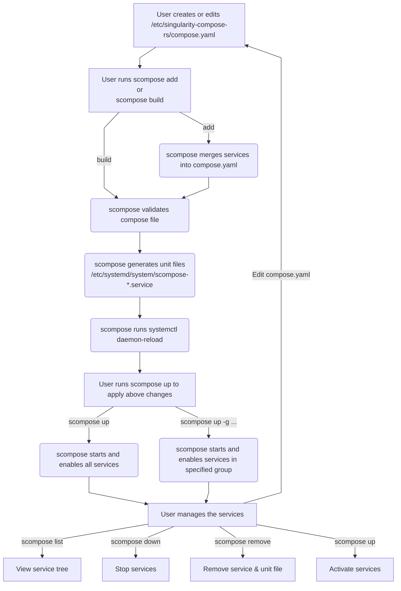

# singularity-compose-rs

`singularity-compose-rs` is a simple CLI tool designed to bring some of the benefits of using `docker-compose` to Singularity.

The goal is to:
- define singularity instances as services
- make sure all these instances are running together at startup

The idea is to have a single file where you define all your singularity-based services, and have singularity-compose-rs update the service files for you.
To help even further with managing arbitrarily complex service setups, this tool also allows one to assign hierarchical groups to each individual service definition.

## Requirements

This software only works on Linux, as it's a tool designed to work with `singularity` and `systemd`.
So you need a Linux-based OS, with `systemd` installed (which should be the default for any recent distribution).

You also need to have singularity installed, at `/usr/bin/singularity` for now. This might change in the future if I feel like adding `singularity_path` as an optional field. Please open an issue if you really need it.
If `/usr/bin/singularity` doesn't exist (you've installed `singularity` at another location, or you have `apptainer` and no alias to `singularity`), you may want to run `ln -s <ACTUAL BINARY PATH> /usr/bin/singularity`.


## Service definition keywords

| Keyword         | Type                           | Description                                                                                                                                                                           |
| --------------- | ------------------------------ | ------------------------------------------------------------------------------------------------------------------------------------------------------------------------------------- |
| `service_name`  | string (required)              | Unique identifier for the service. Must not contain line breaks.                                                                                                                      |
| `image`         | string (required)              | Absolute path to the Singularity image (`.sif`) file.                                                                                                                                 |
| `description`   | string (optional)              | Human-readable description of the service. Must not contain line breaks.                                                                                                              |
| `user`          | string (optional)              | The user to run the Singularity instance as. Defaults to `root`.                                                                                                                      |
| `group`         | string (optional)              | The group to run the Singularity instance as. Defaults to `root`.                                                                                                                     |
| `volumes`       | list of strings (can be empty) | Bind mounts formatted as `<host_path>[:<container_path>[:ro]]`.                                                                                                                       |
| `pidfile`       | string (optional)              | Path to the PID file. Defaults to `/run/<service_name>.pid`. Make sure the specified user/group can write it.                                                                         |
| `restart`       | string (optional)              | Restart condition. Must be one of: `no`, `always`, `on-success`, `on-failure`, `on-abnormal`, `on-abort`, `on-watchdog`. Defaults to `always`.                                        |
| `after`         | string (optional)              | systemd `After=` dependency (e.g. `network-online.target`). Defaults to `network-online.target`.                                                                                      |
| `requires`      | string (optional)              | systemd `Requires=` dependency (e.g. `NetworkManager.service`). Defaults to `network-online.target`.                                                                                  |
| `service_group` | string (optional)              | Dot-separated group hierarchy used for filtering with the `--groups` flag (e.g. `web.essential` will make this service both part of the `web` and the `essential` subgroup of `web`). |

Please note that if referring to another service managed by `singularity-compose-rs`, you have to prefix it with `scompose-`. This applies to fields `requires` and `after`.
See the example [below](#example-compose-file).

### Service Groups

Service groups support a hierarchy expressed with `.`.
There are only used to refer to service definitions within the master `compose.yaml` file (in `/etc/singularity-compose-rs`) and in this CLI. They are completely ignored by systemd.

## Install

### Using cargo

You can install the project with cargo:

```bash
git clone git@github.com:SteampunkIslande/singularity-compose-rs.git
cd singularity-compose-rs
cargo install --path .
```

### By copying the binary

```bash
git clone git@github.com:SteampunkIslande/singularity-compose-rs.git
cd singularity-compose-rs
cargo build --release
# Or copy it to wherever you want in your path
sudo cp target/x86_64-unknown-linux-musl/release/singularity-compose-rs /usr/bin
# You can even define an alias
sudo ln -s /usr/bin/singularity-compose-rs /usr/bin/scompose
```

The resulting binary is 100% standalone, you can just copy it and it will work on any linux computer with `Linux kernel >=2.6.39` (so basically any linux distribution will do).


## CLI usage

`singularity-compose-rs` is just a unit files builder. It will write all the appropriate unit files in order for your singularity instances to be defined as services. It then allows you to bring them up all at once, take them down all at once, or let you choose which groups you'd like to start/stop.

The compose file is read from `/etc/singularity-compose-rs/compose.yaml` and this cannot be changed.

You can also specify service groups, and choosing which groups you'd like to build, bring up, or take down.

```
Usage: scompose <COMMAND>

Commands:
  build   (Re)-builds all the unit files
  up      Brings all specified services up
  down    Shuts down all the services that are defined in the singularity-compose.yaml file (or the file specified with --file)
  list    
  add     Merge a compose file into the existing one and (re)-builds
  remove  Remove one or more services from the compose file and stop/disable their unit files
  help    Print this message or the help of the given subcommand(s)

Options:
  -h, --help  Print help
```

### Build

```
(Re)-builds all the unit files

Usage: scompose build [OPTIONS]

Options:
  -n, --dry-run
          Will not write any unit files, only print
          
          This will print every file name, and every file content of all the unit files that would be written without this flag.

  -g, --groups [<GROUPS>...]
          Groups you want to (re)-build (comma-separated)
          
          Note that you can express a group hierarchy with `.`. If omitted, this will build all services defined in `/etc/singularity-compose-rs/compose.yaml`

  -h, --help
          Print help (see a summary with '-h')
```

This calls `systemctl daemon-reload` so the new service files are accounted for by systemd, but it does **not** bring them up.
It is up to the user to bring them up using the `up` command.

### Up

```
Brings all specified services up

Usage: scompose up [OPTIONS]

Options:
  -n, --dry-run
          Will not start any service, only print
          
          This will print the systemctl command that would be run without this flag.

  -g, --groups [<GROUPS>...]
          Groups you want to start
          
          Note that you can express a group hierarchy with `.`. If omitted, this will build all services defined in `/etc/singularity-compose-rs/compose.yaml`

  -h, --help
          Print help (see a summary with '-h')
```

### Down

```
Shuts down all the services that are defined in `/etc/singularity-compose-rs/compose.yaml` (or the ones specified with --groups)

Usage: scompose down [OPTIONS]

Options:
  -n, --dry-run
          

  -g, --groups [<GROUPS>...]
          Groups you want to shutdown (comma-separated)
          
          Note that you can express a group hierarchy with `.`

  -h, --help
          Print help (see a summary with '-h')
```

### List

```
Lists all services defined in `/etc/singularity-compose-rs/compose.yaml`. Displays them as a tree

Usage: scompose list [OPTIONS]

Options:
  -g, --groups [<GROUPS>...]
          Groups you want to list (comma-separated)
          
          Note that you can express a group hierarchy with `.`

  -h, --help
          Print help (see a summary with '-h')
```

> Note: this command is the only one that does **not** require root privileges.

### Add

```
Merge a compose file into the existing one and (re)-builds.

This command only stops/disables/overwrites services that are re-defined in the input file. There is no dry run mode for this command, use with caution!

Usage: scompose add <FILE>

Arguments:
  <FILE>
          YAML file to merge into the existing compose file
          
          Newly defined services will be added to `/etc/singularity-compose-rs/compose.yaml`. Services that were already defined in `/etc/singularity-compose-rs/compose.yaml` will be overwritten if different.

Options:
  -h, --help
          Print help (see a summary with '-h')
```

### Remove

```
Remove one or more services from the compose file and stop/disable their unit files

Usage: scompose remove <SERVICE_NAMES>...

Arguments:
  <SERVICE_NAMES>...  Service names to remove (one or more)

Options:
  -h, --help  Print help
```

## Example Compose File

```yaml
services:
  - service_name: nginxd
    description: Nginx reverse proxy
    user: root
    group: root
    volumes:
      - /root/nginx/nginx.conf:/opt/nginx.conf
      - /var/log
      - /var/cache
    pidfile: /run/nginxd.pid
    image: /root/nginx/nginx.sif
    restart: always
    after: NetworkManager.service
    requires: NetworkManager.service
    service_group: web.essential

  - service_name: gitead
    description: Gitea, the web application for git
    user: USERNAME
    group: USERNAME
    volumes:
      - /home/USERNAME/gitea-install/data-gitea:/data/gitea
    pidfile: /home/USERNAME/gitea.pid
    image: /data/singularity_images/gitea-1.26.4.sif
    after: NetworkManager.service
    requires: NetworkManager.service scompose-nginxd.service
    service_group: web.optional
```

This very basic example lets you compose a simple webapp setup with [`nginx`](https://nginx.org/) and [`gitea`](https://about.gitea.com/) to have your own, self-hosted git webapp (given that you properly configured `nginx.conf` and your dedicated `gitea-data` folder).

## How It Works

For each service defined in the compose file, `singularity-compose-rs` generates a systemd unit file at `/etc/systemd/system/scompose-<service_name>.service`. The generated unit file uses a forking service type and starts the Singularity instance using:

```bash
/usr/bin/singularity instance start --pid-file <pidfile> <binds> <image> <service_name>
```

When `build` is run, the tool validates the compose file, checks that the Singularity images exist and are absolute paths, and writes the unit files. After building, `systemctl daemon-reload` is run automatically.

`up` starts and enables the generated unit files. `down` stops them.


# Tutorial

> This tutorial assumes `singularity-compose-rs` is aliased to `scompose`.

## Lifecycle



## Quick start

1. **Define services** — create `/etc/singularity-compose-rs/compose.yaml` (see [keywords](#service-definition-keywords) and [example](#example-compose-file)).

2. **Build unit files** — run `scompose build`. This validates the compose file, generates `/etc/systemd/system/scompose-<service_name>.service` for each service, and reloads systemd.

3. **Start services** — run `scompose up` to bring everything up, or `scompose up -g <group>` to start a subset (e.g. `scompose up -g web`).

### Adding services later

Instead of editing the main compose file by hand, you can merge a new YAML file into it:

```bash
scompose add /path/to/new-services.yaml
```

This merges the new definitions into `compose.yaml`, stops and re-creates unit files for any redefined services, and rebuilds automatically.

# Troubleshooting

## Service fails to start

| Cause                                         | Solution                                                                                                                                                                                                                                   |
| --------------------------------------------- | ------------------------------------------------------------------------------------------------------------------------------------------------------------------------------------------------------------------------------------------ |
| Specified user and group can't create PIDFile | Make sure that the specified user and group have write access to the parent of the specified pidfile                                                                                                                                       |
| Dependency can't be satisfied                 | If you define services `A` and `B` in the compose file, and service `B` depends on service `A`, you should prefix `A` with `scompose` in the `requires` and `after` keys. That is, `requires: scompose-A` in the definition of service `B` |

# Frequently Asked Questions

## Why can't I choose the path to the compose file?

The goal is to keep things simple and organized. On a given system, there should be only one place to define all the singularity based services. This is why the file `/etc/singularity-compose-rs/compose.yaml` is hard-coded.

## Why are all the generated unit files prefixed with `scompose-`?

So one can easily recognize where they come from, and either delete them if needed using `rm /etc/systemd/system/scompose-*`, or list them using `ls /etc/systemd/system/scompose*`, or stop all singularity-based services with `systemctl stop 'scompose-*'` (don't forget the single quotes).